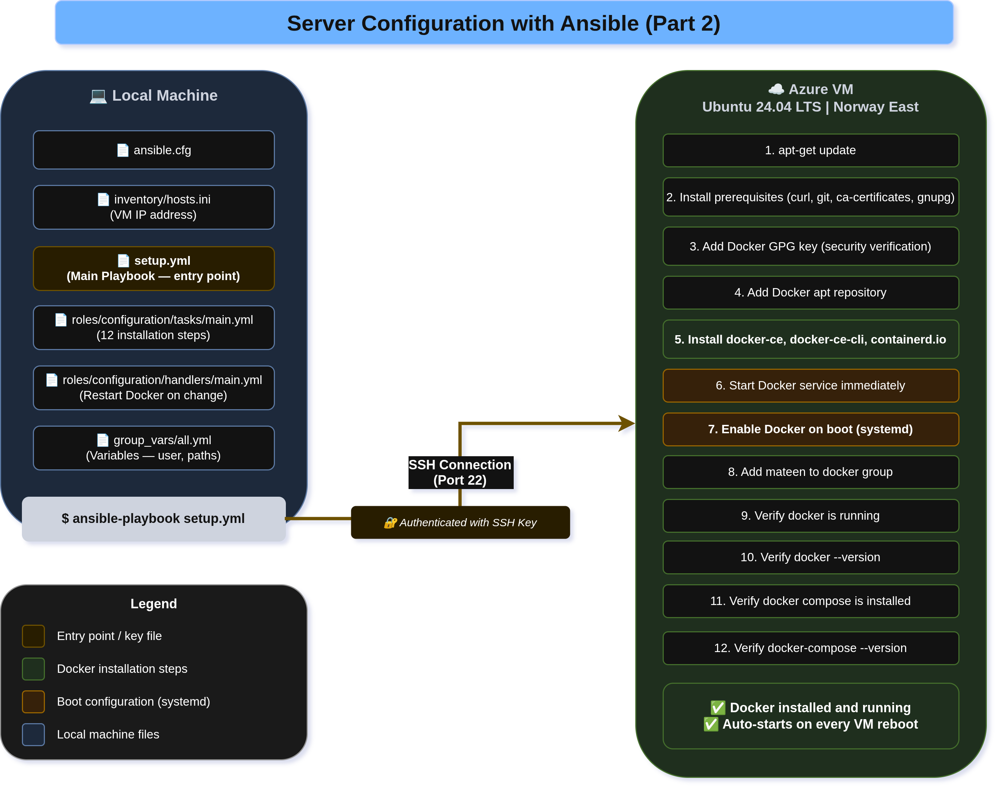

# Part 2 — Configuration & Deployment with Ansible

## Overview

This section covers the automated configuration and deployment of the Azure VM using Ansible.
Instead of manually SSH-ing into the server and running commands one by one,
Ansible connects over SSH from the local machine and executes all steps
automatically in the correct order.

There are **two separate playbooks**:
- `setup.yml` — installs Docker and configures the VM (run once after Terraform)
- `deploy.yml` — copies the app and runs it via Docker Compose (run on every deployment)

---

## Automation Flow

### setup.yml — VM Configuration (`configuration` role)

```
Local Machine
      │
      │  SSH (port 22)
      ▼
Azure VM (test-vm) — northeurope
      │
      ├── 1.  apt-get update
      ├── 2.  Install prerequisites — curl, git, gnupg, lsb-release, python3-pip, etc.
      ├── 3.  Create /etc/apt/keyrings directory
      ├── 4.  Add Docker GPG key — verifies downloads are genuine
      ├── 5.  Add Docker apt repository
      ├── 6.  Install docker-ce, docker-ce-cli, containerd.io, docker-compose-plugin
      ├── 7.  Enable Docker on boot (systemd)
      ├── 8.  Add mateen to docker group (no sudo needed for docker commands)
      ├── 9.  Verify Docker version
      └── 10. Verify Docker Compose version (docker compose version)
```

### deploy.yml — App Deployment (`deploy` role)

```
Local Machine
      │
      │  SSH (port 22)
      ▼
Azure VM (test-vm) — northeurope
      │
      ├── 1.  Create /opt/app directory (owner: mateen)
      ├── 2.  Copy app files to /opt/app (Dockerfile, nginx.conf, docker-compose.yml, src/)
      ├── 3.  Tear down existing containers and images (docker_compose_v2)
      ├── 4.  Build and start containers with Docker Compose (docker_compose_v2)
      ├── 5.  Wait 5 seconds for container to be ready
      ├── 6.  Verify container is running (docker_container_info)
      └── 7.  Test app is responding on http://localhost:8080
```

---

## Folder Structure

```
Ansible/
├── ansible.cfg                          # Global Ansible settings
├── setup.yml                            # Playbook 1 — installs Docker on the VM
├── deploy.yml                           # Playbook 2 — deploys the app via Docker Compose
├── group_vars/
│   └── all.yml                          # Shared variables — current_user: mateen
├── inventory/
│   └── hosts.ini                        # VM IP address and SSH connection details
└── roles/
    ├── configuration/
    │   ├── defaults/
    │   │   └── main.yml                 # Role defaults (empty — vars come from group_vars)
    │   ├── handlers/
    │   │   └── main.yml                 # Restarts Docker only when a change is made
    │   └── tasks/
    │       └── main.yml                 # All Docker installation and configuration steps
    └── deploy/
        ├── defaults/
        │   └── main.yml                 # app_dir: /opt/app
        └── tasks/
            └── main.yml                 # App copy, compose down/up, health check
```

### File Descriptions

| File | Purpose |
|---|---|
| `ansible.cfg` | Sets inventory path, disables host key checking, enables SSH pipelining |
| `setup.yml` | Entry point for VM setup — targets webservers and calls the `configuration` role |
| `deploy.yml` | Entry point for deployment — targets webservers and calls the `deploy` role |
| `group_vars/all.yml` | Shared variable `current_user: mateen` — available to both roles automatically |
| `inventory/hosts.ini` | Defines the VM host — IP, SSH user (`mateen`), ed25519 key path |
| `roles/configuration/tasks/main.yml` | Installs Docker Engine + docker-compose-plugin, configures systemd and user group |
| `roles/configuration/handlers/main.yml` | Restarts Docker service only when triggered by a change |
| `roles/deploy/defaults/main.yml` | Default `app_dir: /opt/app` — overridable per run |
| `roles/deploy/tasks/main.yml` | Copies app files, runs `docker compose up --build`, verifies health |

---

## How to Run

### Prerequisites

**Install Ansible on your local machine (not the VM):**

Installation instructions: https://docs.ansible.com/ansible/latest/installation_guide/intro_installation.html
```bash
brew install ansible
```

Verify:
```bash
ansible --version
```

---

### Step 1 — Confirm your VM IP in hosts.ini

```ini
[webservers]
test-vm ansible_host=XX.XXX.XXX.XXX ansible_user=mateen ansible_ssh_private_key_file=~/.ssh/id_ed25519
```

### Step 2 — Test the connection

```bash
cd Ansible
ansible all -m ping
```

Expected output:
```
test-vm | SUCCESS => { "ping": "pong" }
```

### Step 3 — Run the configuration playbook (first time only)

```bash
ansible-playbook setup.yml
```

This installs Docker and prepares the VM. Only needs to run once unless you rebuild the VM.

### Step 4 — Run the deployment playbook

```bash
ansible-playbook deploy.yml
```

This copies the app files, builds the Docker image via Compose, and starts the container.

Each task shows one of:
- `ok` — already in desired state, no change needed
- `changed` — Ansible applied a change
- `failed` — something went wrong, check the error output

### Step 5 — Verify

SSH in and confirm:

```bash
ssh mateen@20.251.154.215

docker compose ps                   # webapp container should show as running
docker compose logs                 # check nginx output
curl http://localhost:8080          # should return HTML
```

---

## Key Concepts

### Idempotency
Running either playbook multiple times is safe. If Docker is already installed
or the container is already running, Ansible skips those steps and shows `ok`.

```bash
# Safe to run any number of times
ansible-playbook setup.yml
ansible-playbook deploy.yml
```

### Shared Variables via group_vars
`group_vars/all.yml` holds `current_user: mateen`. Ansible loads this automatically
for all hosts — no import needed in playbooks or roles. Both roles can use
`{{ current_user }}` directly.

### Roles
Each role bundles related tasks, handlers, and defaults together:
- `configuration` — owns everything about Docker installation
- `deploy` — owns everything about running the app

### Handlers
`roles/configuration/handlers/main.yml` restarts Docker only when the Docker
Engine installation task reports a change. It does not restart on every run.

---
# Architecture Diagram
See `ansible-flow.drawio.png` for a visual overview of all deployed resources and their relationships.



---

## Troubleshooting

List of frequent Ansible errors during setup and deployment, their causes, and how to fix them:

| Error | Cause | Fix |
|---|---|---|
| `UNREACHABLE` | Wrong IP or VM is off | Check `hosts.ini` IP, verify VM is running in Azure Portal |
| `Permission denied (publickey)` | Wrong SSH key path | Ensure `~/.ssh/id_ed25519` exists and matches the key on the VM |
| `Python not found` | Python not on VM | SSH in and run: `sudo apt install python3` |
| `FAILED - RETRYING` on Docker install | Network issue on VM | Wait and re-run `setup.yml` |
| `community.docker not found` | Collection not installed | Run: `ansible-galaxy collection install community.docker` |