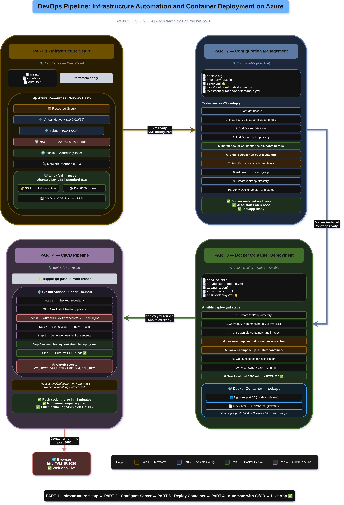

# DevOps Pipeline: Infrastructure Automation and Container Deployment on Azure

This project implements a fully automated DevOps pipeline on Microsoft Azure.
A web application is provisioned, configured, containerised and deployed
automatically using four industry standard tools — each handling a specific
stage of the pipeline.

---

## How It All Connects

```
PART 1          PART 2            PART 3              PART 4
Terraform  ───▶ Ansible      ───▶ Docker          ───▶ GitHub Actions
Provision VM    Configure VM      Deploy Container     Automate Everything
     │               │                 │                      │
     ▼               ▼                 ▼                      ▼
  VM ready     Docker installed   App live on         Push code → live
  SSH open     /opt/app ready     port 8080           in under 2 mins
```

---

## Project Structure

```
docker-ca-project/
├── terraform/          ← Part 1: Azure infrastructure as code
├── Ansible/            ← Part 2: Server configuration + Part 3 & 4 deployment
├── app/                ← Part 3: Web application and Dockerfile
└── .github/workflows/  ← Part 4: CI/CD pipeline
```

---

## Parts

### Part 1 — Infrastructure Setup

Azure cloud infrastructure provisioned using Terraform.
Includes VM, Virtual Network, Subnet, NSG, Public IP and Network Interface.

> 📖 See [terraform/README.md](Terraform/README.md) for full details

### Part 2 — Configuration Management

Azure VM configured automatically using Ansible.
Docker is installed, enabled on boot and the application directory is created.

> 📖 See [Ansible/README.md](Ansible/README.md) for full details

### Part 3 — Docker Container Deployment

Web application containerised using Docker and Nginx.
Deployed to the VM using an Ansible playbook. Accessible at `http://VM_IP:8080`.

> 📖 See [app/README.md](app/README.md) for full details

### Part 4 — CI/CD Pipeline

GitHub Actions pipeline that automatically redeploys the application
on every push to the main branch. Uses the Ansible deploy playbook directly.

> 📖 See [.github/workflows/README.md](.github/workflows/README.md) for full details

---

## Architecture Diagram

The diagram below shows all four parts and how they integrate into one pipeline.



> To view the diagram open `architecture.drawio` at https://app.diagrams.net

Each part is colour coded:

| Colour    | Part                              |
| --------- | --------------------------------- |
| 🟡 Yellow | Part 1 — Terraform Infrastructure |
| 🔵 Blue   | Part 2 — Ansible Configuration    |
| 🟢 Green  | Part 3 — Docker Deployment        |
| 🟣 Purple | Part 4 — GitHub Actions CI/CD     |

---

## Requirements

| Tool           | Purpose                             | Install                                         |
| -------------- | ----------------------------------- | ----------------------------------------------- |
| Terraform      | Infrastructure provisioning         | [terraform.io](https://terraform.io)            |
| Ansible        | Server configuration and deployment | `brew install ansible` or `apt install ansible` |
| Docker         | Container runtime (on the VM)       | Installed automatically by Ansible              |
| GitHub Actions | CI/CD pipeline                      | Built into GitHub — no install needed           |

---

## GitHub Secrets Required

For the CI/CD pipeline to work, add these three secrets to your GitHub repository:

```
Settings → Secrets and variables → Actions → New repository secret
```

| Secret        | Value                          |
| ------------- | ------------------------------ |
| `VM_HOST`     | Azure VM public IP address     |
| `VM_USERNAME` | `mateen`                       |
| `VM_SSH_KEY`  | Base64 encoded private SSH key |

