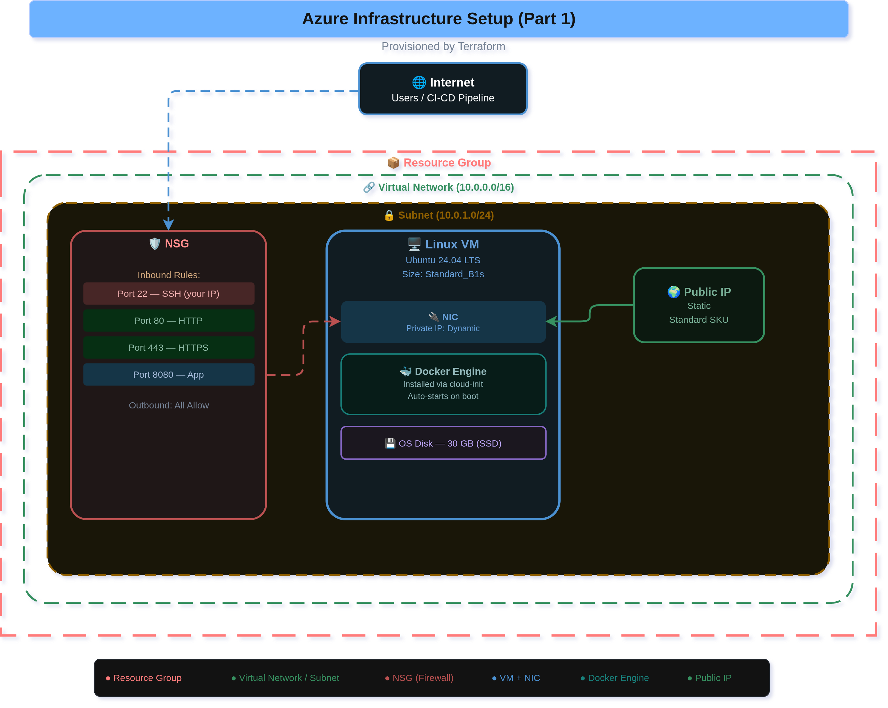

# Part 1 — Infrastructure Setup (Terraform + Azure)

This folder contains Terraform scripts to provision a complete Azure infrastructure ready to host a Dockerized web application.

---

## Resources Created

| Resource | Name | Purpose |
|---|---|---|
| Resource Group | `NetworkingCA-rg` | Container for all resources |
| Virtual Network | `NetworkingCA-vnet` | Isolated private network (10.0.0.0/16) |
| Subnet | `NetworkingCA-subnet` | VM subnet (10.0.1.0/24) |
| Network Security Group | `NetworkingCA-nsg` | Firewall rules (ports 22, 80, 8080) |
| Public IP | `NetworkingCA-pip` | Static public IP for the VM (Standard SKU) |
| Network Interface | `NetworkingCA-nic` | NIC linking VM to subnet & public IP |
| Linux VM | `NetworkingCA-vm` | Ubuntu 24.04 LTS, Standard_B1s |

> Note: Resource names use the `project_name` variable as a prefix. The default value is `NetworkingCA` as set in `terraform.tfvars`.

---

## Prerequisites

1. **Azure CLI** installed and logged in:
   ```bash
   az login
   ```

2. **Terraform** installed (>= 1.3.0):
   ```bash
   brew install terraform
   ```

3. **SSH key pair** generated (ed25519 is used in this project):
   ```bash
   ssh-keygen -t ed25519 -f ~/.ssh/id_ed25519
   ```

---

## Setup & Deploy

### Step 1 — Review your variables

Open `terraform.tfvars` and confirm the values match your setup:
- `admin_username` → the Linux user created on the VM (default: `mateen`)
- `ssh_public_key_path` → path to your SSH public key (default: `~/.ssh/id_ed25519.pub`)
- `location` → Azure region available on your subscription (default: `northeurope`)

### Step 2 — Initialize Terraform

```bash
terraform init
```

### Step 3 — Preview the plan

```bash
terraform plan
```

Review the list of resources to be created.

### Step 4 — Apply

```bash
terraform apply
```

Type `yes` when prompted. Deployment takes ~3 minutes.

### Step 5 — Get your outputs

```bash
terraform output
```

You will see:
- `public_ip_address` — the VM's public IP
- `ssh_command` — copy-paste to SSH in
- `app_url` — where your web app will be accessible after Ansible deploys it

---

## Connecting to the VM

```bash
# SSH using the output command
ssh mateen@<public_ip_address>

# Verify the VM is up
uname -a
```

> Docker is **not** pre-installed by Terraform. It is installed in Part 2 by Ansible via the `configuration` role.

---

## File Structure

```
Terraform/
├── main.tf            # Core infrastructure resources
├── variables.tf       # Input variable definitions
├── outputs.tf         # Output values printed after apply
└── terraform.tfvars   # Actual variable values used for this project
```

---

## Cleanup (Destroy All Resources)

```bash
terraform destroy
```

This removes all Azure resources created by Terraform, stopping any charges.

---

## Architecture Diagram

See `architecture-diagram.drawio.png` for a visual overview of all deployed resources and their relationships.

